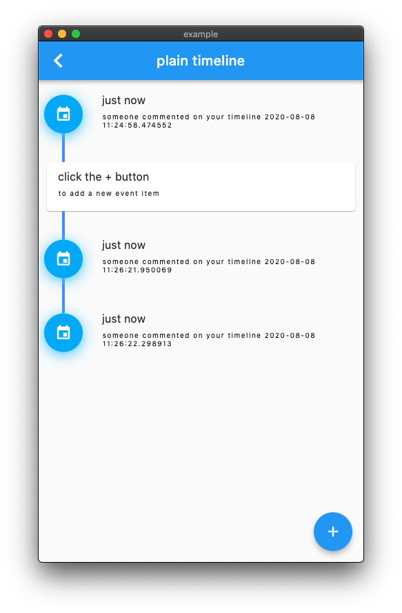

# flutter_timeline [](https://pub.dev/packages/flutter_timeline)


> a fully customizable & general timeline widget, based on real-world application references

- ✅  fully customizable indicator dot
- ✅  support spacing between indicator dot and lines
- ✅  support spacing between event (items) but leaving the line connected
- ✅  uses custom paint, but yet, indicator and body are fully customizable.
- ✅  2 real-world demos
- ✅  L2R support


## Installation
```yaml
dependencies:
  flutter_timeline: latest
```


## usage
```dart
  TimelineEventDisplay get plainEventDisplay {
    return TimelineEventDisplay(
        child: TimelineEventCard(
          title: Text("just now"),
          content: Text("someone commented on your timeline ${DateTime.now()}"),
        ),
        indicator: TimelineDots.of(context).circleIcon);
  }

  List<TimelineEventDisplay> events;

  Widget _buildTimeline() {
    return TimelineTheme(
        data: TimelineThemeData(lineColor: Colors.blueAccent),
        child: Timeline(
          indicatorSize: 56,
          events: events,
        ));
  }

  void _addEvent() {
    setState(() {
      events.add(plainEventDisplay);
    });
  }
```

## references
https://www.pinterest.com/official_softmarshmallow/flutter-timeline/


## simple example



more documentation available at [github](https://github.com/softmarshmallow/flutter-timeline)
